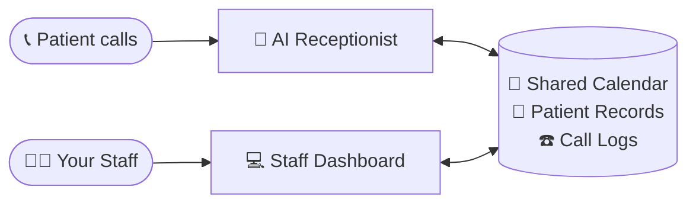
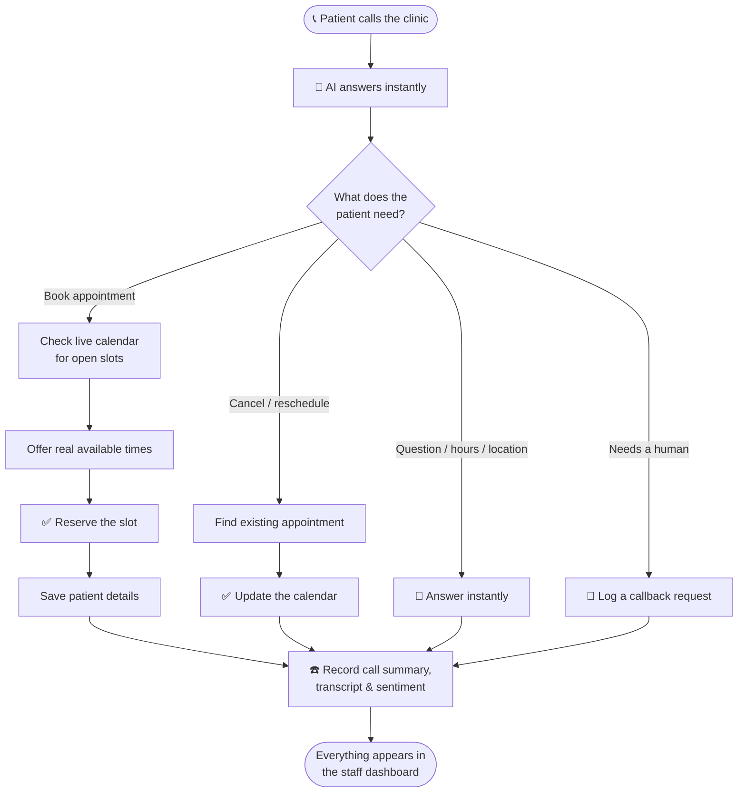

# Sunshine Dental — User Guide

*A plain-English guide to what this app does and how your clinic uses it every day.*

---

## What is this, in one sentence?

It's a **24/7 AI phone receptionist for your dental clinic, plus a simple dashboard your team uses to manage the calendar, patients, and phone calls** — all in one place.

Think of it as hiring a tireless front-desk assistant who never sleeps, never takes a lunch break, and never puts a caller on hold — working alongside a clean, modern admin screen for your staff.

---

## The two halves of the app

### 1. The AI Phone Receptionist 🤖📞

When a patient calls your clinic, an AI voice agent picks up and has a natural conversation — just like talking to a real receptionist. It can:

- **Answer common questions** ("What are your hours?", "Where are you located?", "Do you take walk-ins?")
- **Book appointments** — it checks who's available, offers real open time slots, and reserves the spot
- **Cancel or reschedule** existing appointments
- **Take down new patient details** (name, phone, reason for visit)
- **Handle callback requests** when a human needs to follow up
- **Speak more than one language**, so you can serve a wider community

The key point: it works around the clock. A patient with a toothache at 9 PM on a Sunday can still book an appointment for Monday morning — no missed calls, no full voicemail box, no lost business.

### 2. The Staff Dashboard 💻

This is the web screen your team logs into. It's where the humans stay in control of everything the AI does. From here, staff can see every appointment, manage the calendar, look up patients, and review what happened on every phone call.

Staff sign in with their own email and password:

---

## How it all fits together

The AI receptionist and your staff dashboard share **one calendar and one patient list** — so everything stays in sync automatically. The AI handles the phone; your team supervises from the dashboard.

## What happens on a call

Here's the journey of a single phone call — from ring to booked appointment:

---

## What your team can do in the dashboard

### 📊 Dashboard (home screen)
A quick "how are we doing today" overview — today's appointments, patients waiting for a callback, how many calls came in this week, and how happy callers sounded.

### 📅 Calendar
The heart of the app. A visual weekly/daily/monthly calendar showing all appointments and each dentist's working hours.

- **Set working hours** — mark when each provider is available for bookings
- **Block off time** — lunch breaks, meetings, admin time
- **Mark vacations** — time off, so nothing gets booked while a dentist is away
- **Book, move, or cancel appointments** with simple clicks and drag-and-drop
- See **all providers side-by-side** so the front desk can manage the whole clinic at a glance

The AI receptionist reads from this same calendar — so it only ever offers time slots that are genuinely free. No double-bookings.

### 👥 Patients
A simple address book of everyone who's contacted the clinic. The AI automatically adds new callers here, and staff can search, view history, and update details.

### 📋 Appointments
A clean list of every appointment — upcoming, completed, or cancelled. Filter by day, by dentist, or by patient. Mark visits as completed when they're done.

### ☎️ Call Logs
A record of every phone call the AI handled, including:
- A written **summary** of what the call was about
- The full **transcript** (word-for-word) if you want the details
- How the caller seemed to **feel** (positive / neutral / unhappy)
- Whether the call was **successful**

This is your quality-control window — you can always see exactly what the AI said and did.

### 👤 Users (Admins)
Owners and managers manage their team here — creating staff accounts and setting each person's role.

### ⚙️ Settings
Personal account preferences — update your name, change your password, and (for dentists) delegate your calendar to an assistant. Language and light/dark theme are toggled any time from the top bar.

---

## Who uses what (roles)

Different staff members see different things, so everyone gets exactly the access they need:

| Role | What they do |
|------|--------------|
| **Provider** (Dentist) | Manages their own calendar and availability, sees their own appointments, marks visits complete |
| **Assistant** (Front desk) | Manages the whole clinic — all calendars, all appointments, patient records, and call logs |
| **Admin** (Owner / Manager) | Everything above, plus creating staff accounts and managing the team |

A dentist can also **delegate** their calendar to an assistant — letting the front desk manage their schedule on their behalf.

---

## A day in the life

**8:55 PM, after hours.** A patient calls with a chipped tooth. The AI answers, finds the next available emergency slot tomorrow at 9:00 AM with Dr. Nguyen, books it, takes the patient's name and number, and confirms. No human involved.

**9:05 AM, next morning.** The front desk assistant logs in. The dashboard already shows the new 9:00 AM appointment on the calendar and the new patient in the system. She reads the call summary, sees everything is in order, and gets the room ready.

**Throughout the day.** Patients call to reschedule, ask about hours, or request callbacks. The AI handles the routine ones; anything unusual is logged for staff to follow up. The team spends its time on patients in the chair — not stuck on the phone.

---

## Why clinics love it

- **Never miss a call** — every call is answered, even nights, weekends, and holidays
- **No more phone tag** — patients book themselves, instantly
- **Fewer no-shows** — appointments are confirmed and recorded the moment they're made
- **Free up your front desk** — staff focus on in-person patients instead of the phone
- **Full transparency** — every call is summarized and recorded, so you're always in control
- **Speaks your patients' languages** — serve more of your community
- **One simple system** — calendar, patients, and calls all in one place (no more juggling spreadsheets and separate calendars)

---

## Frequently asked questions

**Does the AI replace my staff?**
No — it handles the repetitive phone work so your team can focus on patients. Your staff stays fully in control through the dashboard.

**What if the AI can't handle a call?**
It records the request (including callback requests) so a human can follow up. You see everything in the Call Logs.

**Can I see what the AI told a patient?**
Yes. Every call has a full written transcript and summary in the Call Logs.

**Will it double-book us?**
No. The AI books only from your live calendar, so it only offers slots that are actually free.

**Is patient information kept private?**
Yes. Access is restricted by role, accounts are password-protected, and only your authorized staff can log in.

---

*Questions or want a walkthrough? Get in touch — we're happy to give you a live demo.*
